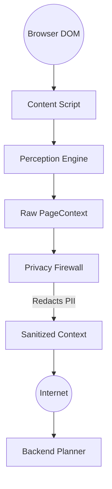
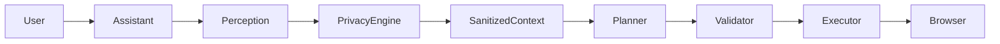

<div align="center">
  <h1>🛡️ Privacy-Preserving AI Browser Agent</h1>
  <p><strong>SIH26171 – On-device Visual Perception for Lightweight Browser Agents</strong></p>
  <p>An intelligent, privacy-first browser agent that lives directly inside your web pages. It provides a draggable floating assistant, a native Chrome side panel, and deep page-aware AI understanding without compromising user security.</p>
</div>

<hr />

## 🌟 Problem Statement & Vision

**Problem (SIH26171):** Current AI browser agents exfiltrate massive amounts of sensitive user data (HTML, DOM, personal information) to cloud servers to function. We need an agent that can actively perceive and interact with webpages *locally*, shielding user data from cloud exfiltration.

**Our Vision:** `SEE LOCALLY ➔ PROTECT LOCALLY ➔ REASON ➔ ACT LOCALLY`

By performing DOM extraction and strict privacy redaction purely on the client side, we ensure that the AI backend only ever receives semantic placeholders, never raw personal data.

---

## 🚀 Current Status & Features

- **Phase 1: UI/UX Shell** — Complete ✅
  - Chrome Manifest V3 side panel & floating assistant.
  - Shadow DOM isolation preventing CSS bleeding.
  - State synchronization across tabs via Chrome Storage.
- **Phase 2: Perception Engine** — Complete ✅
  - Local DOM perception extracting headings, forms, inputs, and buttons.
  - Invisible element filtering & DOM minimization.
  - Temporary local Element Registry generation.
- **Phase 3: Browser Action Engine** — Complete ✅
  - Safe Action Execution (clicks, typing, navigation, scrolling).
  - Strict JSON-based action schema with user-confirmation for high-risk actions.
  - Zero `eval()` or dangerous JS injection.
- **Phase 4: Local Privacy Firewall** — Complete ✅
  - Deep privacy filtering via Regex and DOM metadata heuristics.
  - Detects and redacts Passwords, OTPs, API Keys, Emails, Phones.
  - **Indian PII Support:** Aadhaar, PAN, UPI, IFSC.
  - Semantic placeholder replacement (e.g., `john@example.com` becomes `[EMAIL]`).
  - Real-time Privacy Audit Dashboard in the Side Panel.
- **Phase 5: Local Privacy Vault & On-Device Action Engine** — Complete ✅
  - Persistent, client-only profile storage via `chrome.storage.local`.
  - Zero-cloud profile autofill: maps stored credentials directly into active form fields on-device.
  - One-click profile extraction from active web pages.
  - Hybrid On-Device Action Engine (`LocalCommandParser`): instant execution for deterministic commands (`type`, `click`, `select`, `scroll`), preventing cloud API rate limits (`429`) and eliminating sensitive data leakage.

---

## 🏗️ Architecture

### 1. Privacy Architecture (Zero-Leakage)

Raw browser information is processed strictly within the local Chrome Extension sandbox. Sensitive information is mutated into semantic placeholders before transmission. 



### 2. System Execution Loop



---

## 🛠️ Implementation Details

For a granular, step-by-step breakdown of how the extension, the action engine, and the privacy firewall were engineered from scratch, please read:
👉 **[Implementation Steps & Engineering Deep Dive](docs/implementation-steps.md)**

---

## ⚙️ Installation & Setup Guide

### Prerequisites
- [Node.js](https://nodejs.org/) (v18+ recommended)
- [Python](https://www.python.org/downloads/) (3.9+ recommended)
- Google Chrome browser

### Step 1: Start the Backend AI Server
The backend requires an LLM API key (Google Gemini) to generate action plans.

1. Navigate to the backend directory:
   ```bash
   cd backend
   ```
2. Install the required Python packages:
   ```bash
   pip install -r requirements.txt
   ```
3. Set up your API key:
   - Rename `.env.example` to `.env` (or create one).
   - Add your API key: `GEMINI_API_KEY=your_google_gemini_api_key`
4. Run the local planner server:
   ```bash
   uvicorn main:app --reload
   ```
   *The backend will now be listening on `http://localhost:8000`.*

### Step 2: Build the Chrome Extension
1. Open a new terminal and navigate to the extension directory:
   ```bash
   cd privacy-browser-agent
   ```
2. Install Node dependencies:
   ```bash
   npm install
   ```
3. Compile and build the extension:
   ```bash
   npm run build
   ```
   *This generates a `dist/` folder containing the compiled extension.*

### Step 3: Load the Extension into Chrome
1. Open Google Chrome and navigate to `chrome://extensions/`.
2. Turn on **"Developer mode"** (toggle in the top right corner).
3. Click **"Load unpacked"** in the top left.
4. Select the `privacy-browser-agent/dist` folder.
5. *Tip: Pin the "Privacy Browser Agent" icon to your Chrome toolbar for easy access!*

---

### Step 4: Start the Local Test Hub Server
To view the unified Testing Hub and Playgrounds, run a local Python HTTP server in the root directory:
```bash
python -m http.server 8080
```
*The Test Hub will be available at `http://localhost:8080/testing/index.html`.*

---

## 🔐 On-Device Privacy Vault (Local Profile Memory)

The **Privacy Vault** allows the agent to remember your personal credentials (e.g., name, Aadhaar, PAN, card details, phone, email) so you don't have to re-type them into forms repeatedly.

> [!IMPORTANT]
> **Zero Cloud Exfiltration:** Vault data is stored **100% locally** in Chrome's sandboxed `chrome.storage.local`. It is **never** sent to the AI backend, **never** synced to any remote server, and **never** leaves your browser sandbox.

### How to Add Data to the Vault

There are three ways to manage your vault credentials:

#### Method 1: Manual Entry via Side Panel UI (Recommended)
1. Open the **Side Panel** in Chrome (click the extension icon in your toolbar).
2. Click the **Vault** tab (with the lock icon 🔒) at the top.
3. Type your personal details into the corresponding fields:
   - **Full Name** (e.g., `Aryan Dalwadi`)
   - **Email Address** (e.g., `aryan@example.com`)
   - **Phone Number** (e.g., `+91 9876543210`)
   - **Aadhaar Number** (e.g., `1234 5678 9012`)
   - **PAN Card** (e.g., `ABCDE1234F`)
   - **Cardholder Name** (e.g., `Aryan D.`)
   - **Card Number & CVV & Expiry**
   - **Street Address**
4. Click **"Save to Local Vault"**. You will see a confirmation badge confirming the data is safely stored on-device.

#### Method 2: One-Click Extraction from Current Web Page
If you already have a profile page, mock KYC, or credentials page open (e.g., `demo/index.html`):
1. Navigate to the page in Chrome.
2. Open the **Vault** tab in the Side Panel.
3. Click the **"Import from Page"** button.
4. The perception engine parses the page DOM, automatically maps detected fields (Name, Aadhaar, PAN, Card), and updates your vault immediately.

#### Method 3: Natural Language Prompt
In the Assistant **Chat** tab, simply prompt:
- `/do import details from this page`
- `/do remember my details`

#### How to Clear or Reset the Vault
- In the **Vault** tab, click **"Clear Vault"** at the bottom. This immediately purges all keys from `chrome.storage.local`.

---

## ⚡ Instant On-Device Commands & Sample Prompts

The agent uses a **Hybrid Execution Engine**:
- **Deterministic actions** (`type`, `fill`, `click`, `select`, `scroll`) are parsed and executed **100% on-device** via `LocalCommandParser`.
- **Zero API Quota Usage**: Does not consume your Gemini rate limits (`429 RESOURCE_EXHAUSTED` immune).
- **0ms Network Delay**: Executes instantaneously.
- **Absolute Privacy**: Sensitive values like OTPs, passwords, and IDs are typed straight into the DOM without touching external network requests.

### Sample Command Reference

Prefix action prompts with `/do` in the Side Panel Chat:

| Category | Prompt Examples | What It Does |
| :--- | :--- | :--- |
| **Form Autofill (from Vault)** | `/do fill the form`<br>`/do autofill form`<br>`/do fill details from my vault` | Matches form fields on the active tab against your local Vault and populates all matching fields (Name, Aadhaar, Email, etc.) automatically. |
| **Field Typing (Values)** | `/do type 123456 in the OTP field`<br>`/do fill the OTP field with 654321`<br>`/do enter Aryan into name`<br>`/do fill user@example.com in email` | Finds the target input field using fuzzy label & semantic matching and types the specified value. |
| **Combined Actions** | `/do type Aryan in name and click submit`<br>`/do fill 123456 in otp and click confirm` | Executes sequential actions (typing followed by button clicks) in a single command. |
| **Clicks & Submissions** | `/do click Submit`<br>`/do click Search Flights`<br>`/do submit the form`<br>`/do tap Confirm` | Identifies matching buttons or links by text/ID/ARIA label and triggers a trusted click event. |
| **Dropdown Selects** | `/do select India in country`<br>`/do select Economy in class` | Finds the appropriate `<select>` element and chooses the requested option. |
| **Scrolling & Navigation** | `/do scroll down`<br>`/do scroll up`<br>`/do scroll to bottom` | Smoothly scrolls the active viewport on-device. |
| **Vault Extraction** | `/do import details from this page`<br>`/do remember my details from page` | Scans page text, extracts recognized profile entities, and saves them to your local Vault. |

---

## 🧪 End-to-End Testing Guide

We have created an entire local ecosystem of sandboxes for you to safely test the Action Engine, Vault, and Privacy Firewall. 

To access all testing environments, navigate to the **[Central Test Hub](http://localhost:8080/testing/index.html)** in your browser after completing Step 4.

### Available Playgrounds
1. **[Advanced Checkout (`testing/test-advanced-checkout.html`)](http://localhost:8080/testing/test-advanced-checkout.html)**: Tests complex NLP mappings with tricky field labels (e.g., "Digital Contact Address").
2. **[Gov KYC Portal (`testing/test-kyc-portal.html`)](http://localhost:8080/testing/test-kyc-portal.html)**: Extremely sensitive data test (Aadhaar, PAN, OTPs) to ensure zero-cloud leakage.
3. **[Data Extractor (`testing/test-data-extraction.html`)](http://localhost:8080/testing/test-data-extraction.html)**: A mock invoice to test the agent's ability to extract and save profile data directly to your Vault.
4. **[Privacy Sandbox (`testing/privacy-test.html`)](http://localhost:8080/testing/privacy-test.html)**: The classic Privacy Firewall sandbox for testing redaction across every PII category.
5. **[Flight Search (`testing/test-playground.html`)](http://localhost:8080/testing/test-playground.html)**: Basic action execution playground (Typing, Dropdowns, Checkboxes).

### Testing the Privacy Firewall
1. Open the **Privacy Sandbox** or **Gov KYC Portal** in Chrome.
2. Open the Assistant Side Panel and navigate to the **Privacy Firewall** tab.
3. As the agent perceives the DOM, it will instantly show active redactions for sensitive data like Aadhaar and PAN cards.
4. **Zero Network Leakage**: Open Chrome DevTools (Network tab), ask the agent a question, and inspect the `POST /api/agent/plan` payload. You will only see `[AADHAAR]`, `[PAN]`, and `[EMAIL]` placeholders sent to the server.

### Testing the Action Engine
1. Open the **Flight Search** or **Advanced Checkout** playground.
2. Ensure your Vault is populated with test data (use the cheatsheet from the Demo page).
3. Type: `/do autofill the form` or `/do type [NAME] in the Name field and click Search`.
4. **Expected Result**: The local executor will parse the LLM action plan, instantly match the fields using fuzzy semantic matching, and execute physical DOM actions (typing, clicking) without touching any external APIs.

---

## 📚 Documentation Directory

- **[Privacy Firewall Architecture](docs/privacy.md)**
- **[Security Threat Model](docs/security-threat-model.md)**
- **[Privacy Testing Guide](docs/privacy-testing.md)**
- **[Full Implementation Steps](docs/implementation-steps.md)**
- **[Changelog](CHANGELOG.md)**
- **[Future Roadmap](docs/roadmap.md)**
