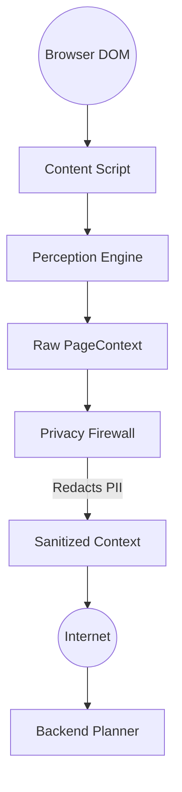
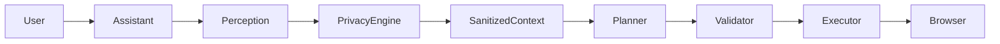

<div align="center">
  <h1>🛡️ Privacy-Preserving AI Browser Agent</h1>
  <p><strong>SIH26171 – On-device Visual Perception for Lightweight Browser Agents</strong></p>
  <p>An intelligent, privacy-first browser agent that lives directly inside your web pages. It provides a draggable floating assistant, a native Chrome side panel, and deep page-aware AI understanding without compromising user security.</p>
</div>

<hr />

## 🌟 Problem Statement & Vision

**Problem (SIH26171):** Current AI browser agents exfiltrate massive amounts of sensitive user data (HTML, DOM, personal information) to cloud servers to function. We need an agent that can actively perceive and interact with webpages *locally*, shielding user data from cloud exfiltration.

**Our Vision:** `SEE LOCALLY ➔ PROTECT LOCALLY ➔ REASON ➔ ACT LOCALLY`

By performing DOM extraction and strict privacy redaction purely on the client side, we ensure that the AI backend only ever receives semantic placeholders, never raw personal data.

---

## 🚀 Current Status & Features

- **Phase 1: UI/UX Shell** — Complete ✅
  - Chrome Manifest V3 side panel & floating assistant.
  - Shadow DOM isolation preventing CSS bleeding.
  - State synchronization across tabs via Chrome Storage.
- **Phase 2: Perception Engine** — Complete ✅
  - Local DOM perception extracting headings, forms, inputs, and buttons.
  - Invisible element filtering & DOM minimization.
  - Temporary local Element Registry generation.
- **Phase 3: Browser Action Engine** — Complete ✅
  - Safe Action Execution (clicks, typing, navigation, scrolling).
  - Strict JSON-based action schema with user-confirmation for high-risk actions.
  - Zero `eval()` or dangerous JS injection.
- **Phase 4: Local Privacy Firewall** — Complete ✅
  - Deep privacy filtering via Regex and DOM metadata heuristics.
  - Detects and redacts Passwords, OTPs, API Keys, Emails, Phones.
  - **Indian PII Support:** Aadhaar, PAN, UPI, IFSC.
  - Semantic placeholder replacement (e.g., `john@example.com` becomes `[EMAIL]`).
  - Real-time Privacy Audit Dashboard in the Side Panel.

---

## 🏗️ Architecture

### 1. Privacy Architecture (Zero-Leakage)

Raw browser information is processed strictly within the local Chrome Extension sandbox. Sensitive information is mutated into semantic placeholders before transmission. 



### 2. System Execution Loop



---

## 🛠️ Implementation Details

For a granular, step-by-step breakdown of how the extension, the action engine, and the privacy firewall were engineered from scratch, please read:
👉 **[Implementation Steps & Engineering Deep Dive](docs/implementation-steps.md)**

---

## ⚙️ Installation & Setup Guide

### Prerequisites
- [Node.js](https://nodejs.org/) (v18+ recommended)
- [Python](https://www.python.org/downloads/) (3.9+ recommended)
- Google Chrome browser

### Step 1: Start the Backend AI Server
The backend requires an LLM API key (Google Gemini) to generate action plans.

1. Navigate to the backend directory:
   ```bash
   cd backend
   ```
2. Install the required Python packages:
   ```bash
   pip install -r requirements.txt
   ```
3. Set up your API key:
   - Rename `.env.example` to `.env` (or create one).
   - Add your API key: `GEMINI_API_KEY=your_google_gemini_api_key`
4. Run the local planner server:
   ```bash
   uvicorn main:app --reload
   ```
   *The backend will now be listening on `http://localhost:8000`.*

### Step 2: Build the Chrome Extension
1. Open a new terminal and navigate to the extension directory:
   ```bash
   cd privacy-browser-agent
   ```
2. Install Node dependencies:
   ```bash
   npm install
   ```
3. Compile and build the extension:
   ```bash
   npm run build
   ```
   *This generates a `dist/` folder containing the compiled extension.*

### Step 3: Load the Extension into Chrome
1. Open Google Chrome and navigate to `chrome://extensions/`.
2. Turn on **"Developer mode"** (toggle in the top right corner).
3. Click **"Load unpacked"** in the top left.
4. Select the `privacy-browser-agent/dist` folder.
5. *Tip: Pin the "Privacy Browser Agent" icon to your Chrome toolbar for easy access!*

---

## 🧪 End-to-End Testing Guide

We have created local sandboxes for you to safely test the Action Engine and the Privacy Firewall.

### 1. Testing the Privacy Firewall
1. Open [docs/privacy-test.html](docs/privacy-test.html) in Chrome. This page is filled with mock Aadhaar, PAN, Credit Cards, and passwords.
2. Open the Assistant Side Panel.
3. Observe the **Privacy Firewall** tab. It will instantly show that it inspected elements and actively redacted sensitive data locally.
4. To verify zero network leakage, open the **Network Tab** in your Chrome DevTools, ask the agent a question, and inspect the `POST /api/agent/plan` payload. You will see placeholders like `[EMAIL]` and `[AADHAAR]` instead of the raw data.

### 2. Testing the Action Engine
1. Open [docs/test-playground.html](docs/test-playground.html) in Chrome.
2. Open the Side Panel Chat.
3. Type: `/do Type Kavya in the Name field and click Submit`
4. **Expected Result:** 
   - The agent perceives the DOM.
   - The LLM creates a structured `type` and `click` action plan.
   - The local executor physically types the text and clicks the button, triggering the success alert.

---

## 📚 Documentation Directory

- **[Privacy Firewall Architecture](docs/privacy.md)**
- **[Security Threat Model](docs/security-threat-model.md)**
- **[Privacy Testing Guide](docs/privacy-testing.md)**
- **[Full Implementation Steps](docs/implementation-steps.md)**
- **[Changelog](CHANGELOG.md)**
- **[Future Roadmap](docs/roadmap.md)**
