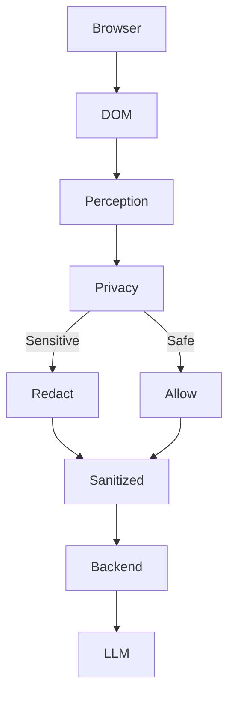
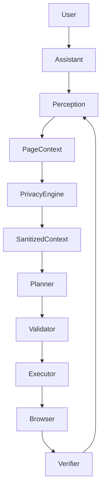

# Privacy Browser Agent 🛡️ (SIH_26)

An intelligent, privacy-first browser agent that lives directly inside your web pages. It provides a draggable floating assistant, a native Chrome side panel, and deep page-aware AI understanding without compromising user security.

## Problem Statement

This project addresses SIH26171, focusing on creating a secure, privacy-first AI agent that can actively perceive and interact with webpages locally, shielding user data from cloud exfiltration.

## Vision

SEE LOCALLY ➡️ PROTECT LOCALLY ➡️ REASON ➡️ ACT LOCALLY

## Current Status

- **Phase 1 (UI/UX Shell)** — Complete ✅
- **Phase 2 (Perception Engine)** — Complete ✅
- **Phase 3 (Browser Action Engine)** — Complete ✅
- **Phase 4 (Local Privacy Firewall)** — Complete ✅

## Features

### Implemented
- Chrome Manifest V3 side panel & floating assistant.
- Local DOM perception (headings, forms, inputs, buttons).
- Deep privacy filtering (passwords immediately redacted in-memory).
- Backend LLM Planner (FastAPI + Google Gemini).
- Safe Action Execution (clicks, typing, navigation, scrolling).
- Strict JSON-based action schema with user-confirmation for actions.
- Local Privacy Firewall (Detects and redacts PII like Emails, Passwords, Aadhaar, PAN, Cards *before* hitting network).

### In Progress / Planned
- Phase 5: Autonomous Vision (Local screenshots, Visual Privacy).
- Phase 6: Voice (STT + TTS).

## Privacy Architecture

Raw browser information is processed locally. Sensitive information is detected and redacted locally. Only sanitized context is allowed to reach the server.



## System Architecture



---

## ⚙️ Installation & Setup Guide

### Prerequisites
- [Node.js](https://nodejs.org/) (v18+ recommended)
- [Python](https://www.python.org/downloads/) (3.9+ recommended)
- Google Chrome browser

### 1. Start the Backend AI Server
1. Navigate to the backend directory:
   ```bash
   cd backend
   ```
2. Install the required Python packages:
   ```bash
   pip install -r requirements.txt
   ```
3. Set up your API key:
   - Rename `.env.example` to `.env`.
   - Open `.env` and add your Google Gemini API key: `GEMINI_API_KEY=your_key_here`
4. Run the server:
   ```bash
   uvicorn main:app --reload
   ```
   *The backend will now be running on `http://localhost:8000`.*

### 2. Build the Chrome Extension
1. Open a new terminal and navigate to the extension directory:
   ```bash
   cd privacy-browser-agent
   ```
2. Install Node dependencies:
   ```bash
   npm install
   ```
3. Build the extension:
   ```bash
   npm run build
   ```
   *This will generate a `dist/` folder containing the final extension.*

### 3. Load the Extension into Chrome
1. Open Google Chrome and navigate to `chrome://extensions/`.
2. Turn on **"Developer mode"** (toggle in the top right corner).
3. Click **"Load unpacked"** in the top left.
4. Select the `privacy-browser-agent/dist` folder.
5. *Tip: Pin the "Privacy Browser Agent" icon to your Chrome toolbar for easy access!*

---

## 🧪 End-to-End Testing Guide

We have created a safe local **Test Playground** specifically for verifying Phase 3 actions without affecting real sites.

### Test 1: Using the Test Playground
1. Open `docs/test-playground.html` in your Chrome browser.
2. Open the Assistant Side Panel.
3. Type: `/do Type Kavya in the Name field`
4. **Expected Result:** 
   - The task dashboard opens in the Side Panel.
   - The agent perceives the DOM, identifies the "Name" input.
   - The LLM returns a structured `type` action.
   - The input is safely populated with "Kavya".

### Test 2: Multi-step Actions
1. In the Test Playground, ask: `/do Type Ahmedabad in From, Delhi in To, and click Search`
2. **Expected Result:** The agent plans a sequence of actions, executes them in order, verifies DOM updates, and triggers the search button alert.

### Test 3: Password Redaction (Safety First)
1. On the Test Playground, ask: `/do Type secret123 in the password field.`
2. Check the Action Log in the Side Panel or the browser console.
3. **Expected Result:** The action is completed, but the `PageContext` sent to the backend completely redacts the actual password string (`[REDACTED]`).

### Test 4: Navigation
1. On any page, type: `/do Open the Products page`
2. **Expected Result:** The agent finds the corresponding link and navigates the browser cleanly.
