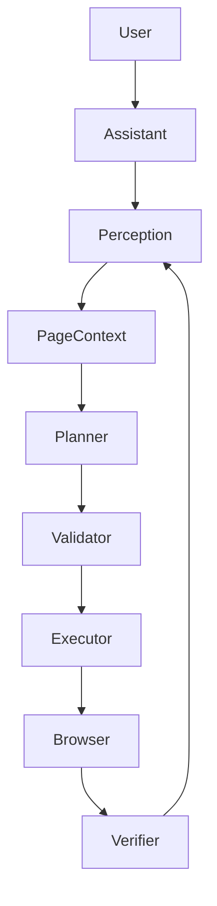

# Privacy Browser Agent Architecture

The agent operates strictly locally within the browser, pushing only structured context to a private AI backend.

### Components
1. **Chrome Extension (Manifest V3):** The frontend shell and content scripts.
2. **Dashboard:** A React application to configure the agent's appearance.
3. **Backend API:** A local FastAPI server managing LLM keys and returning structured schemas.
