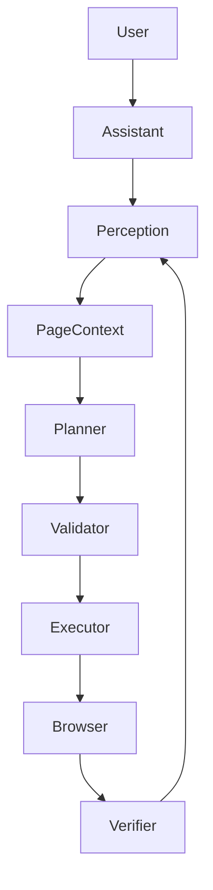

# Phase 3: Browser Action & Control Engine

Phase 3 transforms the privacy-first browser agent from a passive "reader" to an active, controlled "executor".

## Architecture

The Phase 3 execution loop ensures actions are planned, validated, and verified safely.

### Components
1. **AgentController (`src/core/AgentController.ts`)**
   - The central nervous system for tasks.
   - Manages the loop: `Perceive -> Plan -> Validate -> Execute -> Verify`.
   - Maintains the task state in `assistantStore.ts`.

2. **Backend Planner (`backend/main.py`)**
   - Endpoint: `POST /api/agent/plan`
   - Maps natural language instructions and the current `PageContext` into strict JSON `AgentAction` objects.
   - Uses strict system prompts to prevent hallucinations.

3. **Action Validator (`AgentController.ts` & `executor.ts`)**
   - Intercepts actions before execution.
   - Blocks dangerous protocols (`javascript:`, `data:`).
   - Validates bounds (e.g., maximum scroll distance).

4. **Action Executor (`executor.ts` in Content Script)**
   - Resolves internal element IDs (e.g., `button_001`) via the `ElementRegistry`.
   - Safely interacts with the DOM (`click()`, `focus()`, updating `value`, dispatching `input` events).
   - Never uses `eval()` or arbitrary JS strings.

5. **Test Playground (`docs/test-playground.html`)**
   - An offline HTML file specifically designed to safely test agent interactions (typing, clicking, dropdowns, passwords).

## Safety & Privacy Limits
- **No Infinite Loops:** Hard-capped at 10 steps per task.
- **Strict Actions:** Can only execute pre-defined actions (`click`, `type`, `select`, `scroll`, `navigate`, `wait`).
- **No Password Leaks:** Passwords are fully redacted at the perception layer (`[REDACTED]`).
- **User Control:** The Side Panel includes a **"Stop Agent"** button that immediately halts the task loop.
